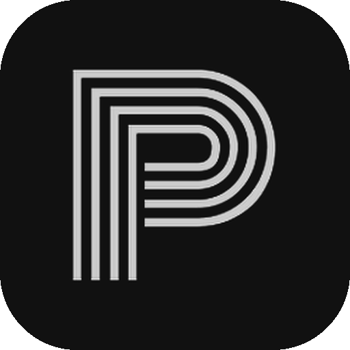
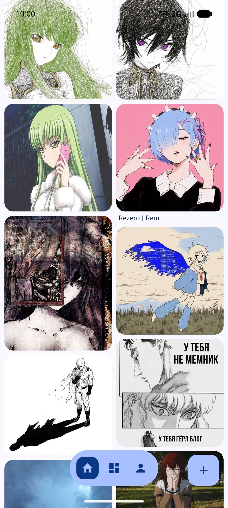
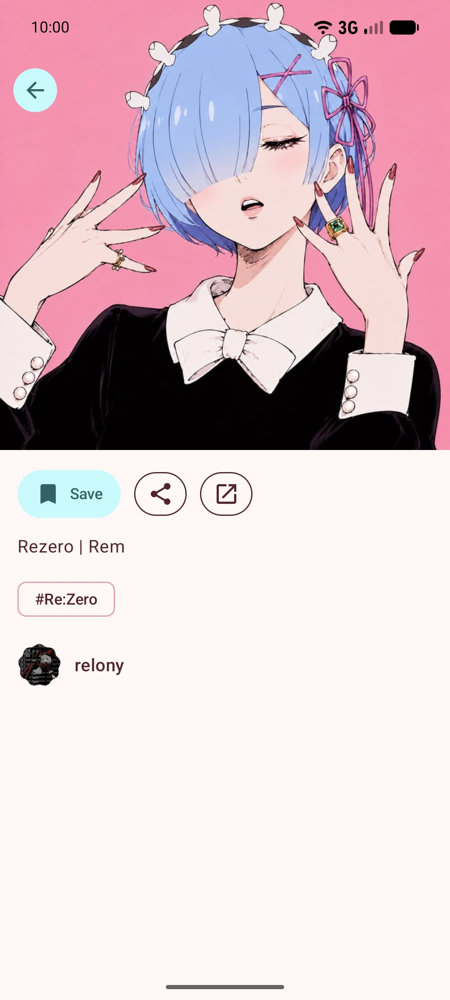
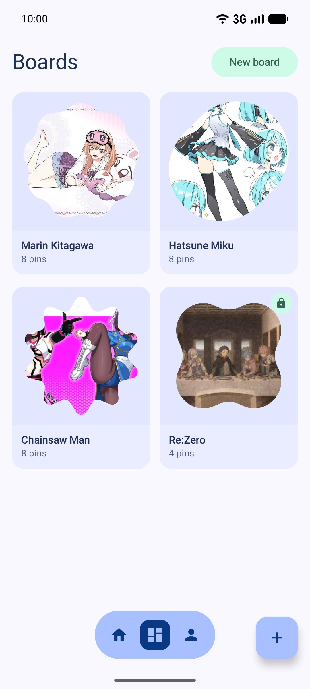
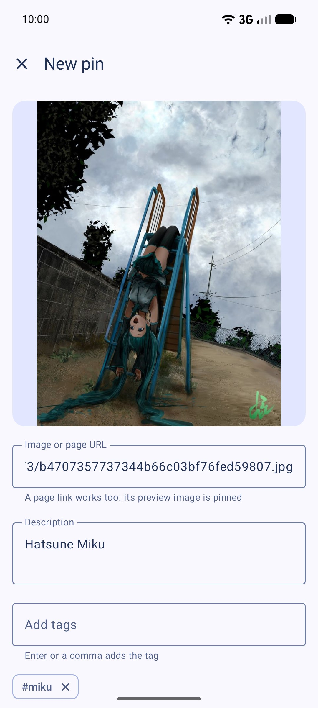
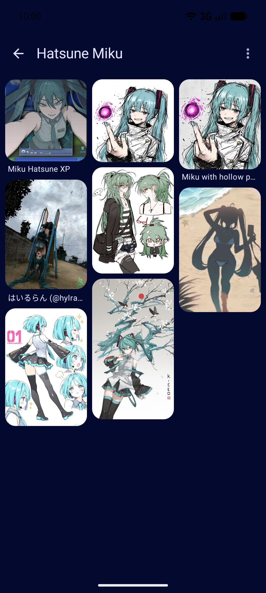

<div align="center">



# Pinry for Android

An unofficial Android app for [Pinry](https://github.com/pinry/pinry), the self-hosted Pinterest alternative.

[](https://github.com/rbprsp/pinry-android/actions/workflows/ci.yml)
[](https://github.com/rbprsp/pinry-android/releases)
[](LICENSE)
[](#requirements)

</div>

<p align="center">
  
  
  
  
  
</p>

## Features

- Browse your Pinry in a masonry feed with infinite scroll, or by tag, user and board. Tap a pin to zoom into the full image.
- Pin from your gallery, from a URL, or from any app with Android's share sheet. Links to web pages use the page's preview image. HEIC and rotated phone photos are fixed before upload.
- Edit and delete your pins, tag them with autocomplete, and manage boards (create, rename, make private, delete).
- Browse public instances without an account, or log in to private ones (`PUBLIC = False`), over https or plain http on your home network.
- Material 3 Expressive design, with colors from your wallpaper or any color you pick, nine palette styles, light, dark and pure black themes, and three grid sizes. Each pin's screen takes its colors from the image, and pins fly from the grid into their own screen.
- A Baseline Profile speeds up startup and scrolling, and the app is about 2.5 MB.
- No analytics, ads or crash reporting. See [PRIVACY.md](PRIVACY.md).

## Requirements

- Android 8.0 (API 26) or newer.
- A [Pinry](https://github.com/pinry/pinry) server with the v2 API (Pinry 2.x) that your phone can reach.

## Install

Download the APK from [Releases](https://github.com/rbprsp/pinry-android/releases), or let [Obtainium](https://github.com/ImranR98/Obtainium) install and update it from this repository.

Releases are signed with this certificate (SHA-256):

```
c05c6b978526f1de6a1be5065fbf6bc15aaed61cfdd4afac86ca845d46bb1105
```

To check a download: `apksigner verify --print-certs pinry-android.apk`.

## Building

You need JDK 21 and the Android SDK.

```sh
./gradlew assembleDebug          # app/build/outputs/apk/debug/
./gradlew testDebugUnitTest      # unit tests
./gradlew assembleRelease        # signed with the debug key unless keystore.properties exists
```

To sign release builds with your own key, copy [`keystore.properties.example`](keystore.properties.example) to `keystore.properties`; it is git-ignored.

The `baselineprofile` module generates the Baseline Profile and holds startup and scroll benchmarks; see [CONTRIBUTING.md](CONTRIBUTING.md#baseline-profile).

## Built with

Kotlin, Jetpack Compose, Material 3 Expressive, Navigation 3, Retrofit, OkHttp, kotlinx.serialization, Coil, [telephoto](https://github.com/saket/telephoto), [MaterialKolor](https://github.com/jordond/MaterialKolor) and DataStore.

## Contributing

Issues and pull requests are welcome on [GitHub](https://github.com/rbprsp/pinry-android/issues). The primary repository is [git.relony.dev/relony/pinry-android](https://git.relony.dev/relony/pinry-android); GitHub is a mirror. See [CONTRIBUTING.md](CONTRIBUTING.md), and [SECURITY.md](SECURITY.md) for reporting vulnerabilities.

## Credits

- [Pinry](https://github.com/pinry/pinry), the server this app is for, and whose logo is the app icon (BSD 2-Clause).
- The icon file comes from [homarr-labs/dashboard-icons](https://github.com/homarr-labs/dashboard-icons) (Apache 2.0).

Details in [NOTICE](NOTICE).

## License

Pinry for Android is free software: you can redistribute it and/or modify it under the terms of the [GNU General Public License](LICENSE) as published by the Free Software Foundation, either version 3 of the License, or (at your option) any later version.

This project is not affiliated with or endorsed by the Pinry project.
